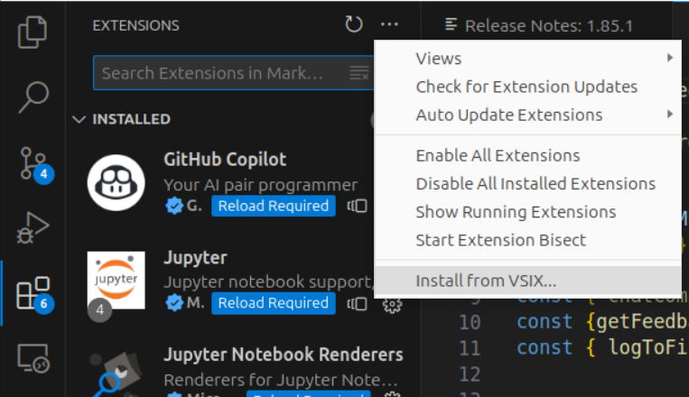
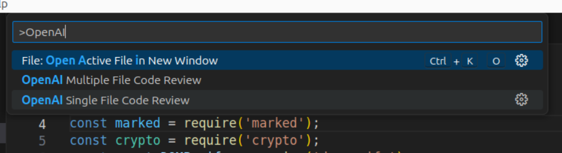

# vscode-extension-openai-code-review

A simple vscode extension that takes the currently open/focused file and submits it to GPT-4 for review and Q&amp;A

## GPT 4 version

* By using Turbo GPT 4 for larger context window, we can drop context size checks for now (tech-debt to add it back to match GPT4 context window;)

* Logs your chats with GPT, including the code submitted, in a log file in your Downloads folder, you can disable this by editing the source code to turn this off.

## How to build it locally

Modify the code to your tastes and then run:

```
npm install -g @vscode/vsce
```

if you don't already have that installed, afterwhich you can run

```
npm install
vsce package
```

to repackage it. Then install it manually as a local extension via Extensions > ... > Install from VSIX:



Then run it via command pallete via either:

```
OpenAI Single File Code Review
```

or

```
OpenAI Mulitple File Code Review
```



## Running Jest test

To run the tests:

```
npm test
```

## To do

* add linting

```
    "lint": "eslint .",
    "pretest": "npm run lint",
```